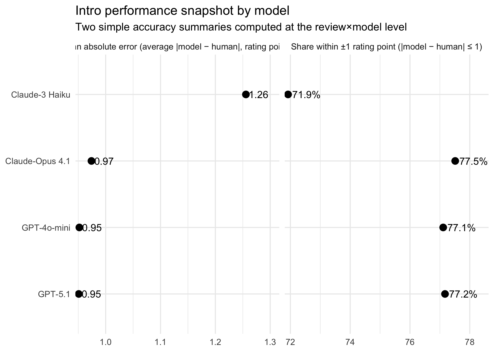
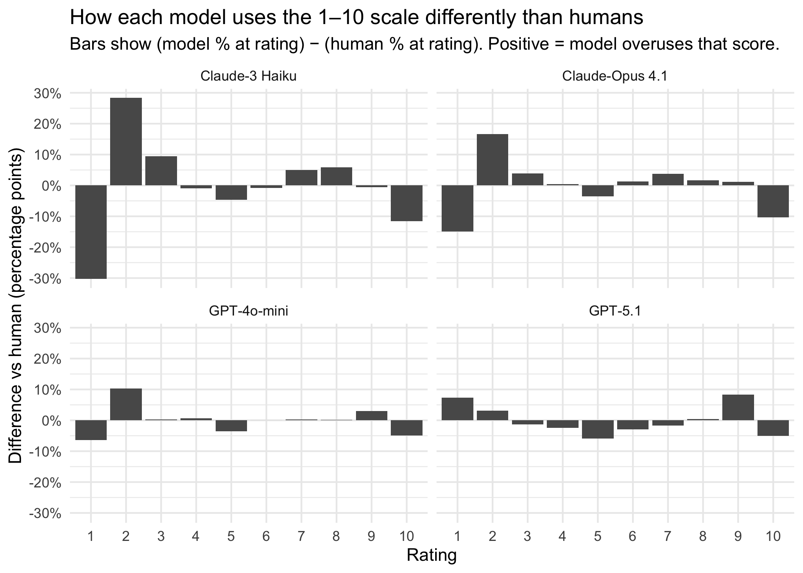
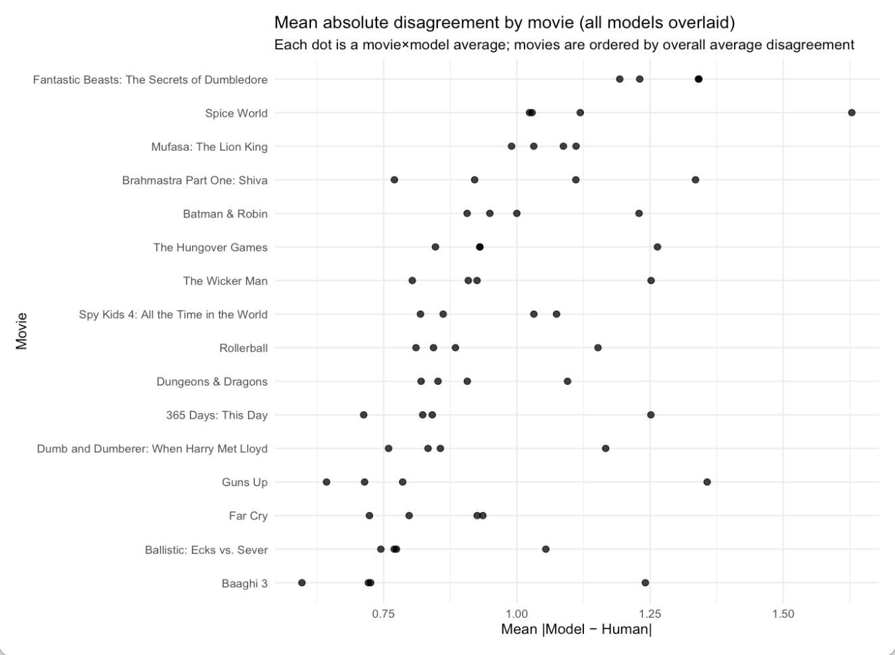
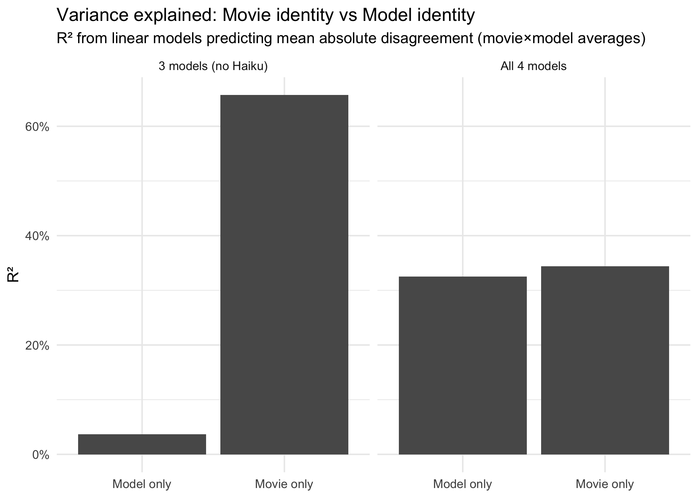
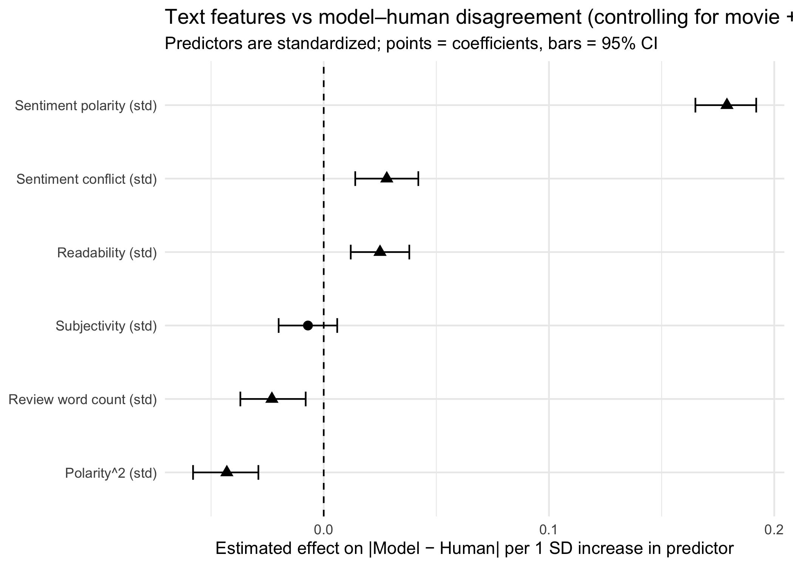

When Do Large Language Models Diverge From Human Judgments?
================
2025-12-29

> If you’re only going to scan one thing: read **Key Findings** + look
> at the **Figures**.
> 
## Objective

**Goal:** Identify *when* and *why* large language models disagree with
human sentiment ratings of movie reviews, and quantify the drivers of
disagreement using interpretable text features and regression.

## Background & Motivation (the short version)

I came into SI 544 from a film / storytelling background. What I like
about movie reviews is that they’re messy in a very human way: people
hedge, exaggerate, contradict themselves, and sometimes write like
they’re arguing with their past self.

So instead of only asking “are models accurate?”, I focused on something
more practical for real use cases:

**When do models *break alignment* with humans — and what patterns
predict that break?**

## Data

**Unit of analysis:** individual movie reviews with human ratings on a
**1–10** scale.

- **Reviews:** 8,209 IMDb reviews (movies only)
- **Models rated the same reviews (4 total):** GPT-4o-mini, GPT-5.1,
  Claude-3 Haiku, Claude-Opus 4.1
- **Long-format analysis table:** 32,836 model–review rows (8,209 × 4)

**Core columns:** - `movie_id`, `movie_title` - `review_title`,
`review` - `human_rating` (1–10) - Text features: `sentiment_polarity`,
`sentiment_conflict`, `subjectivity`, `readability`,
`review_word_count` - Model outputs: model rating columns produced by
the rating scripts

## Methods

### Build a clean, movie-only dataset

- Parse raw IMDb review JSON → clean ratings + review text
- Pull minimal OMDb metadata to **filter to movies** and attach
  `movie_title` (type is used for filtering, not kept as a column)

### Generate AI ratings (same prompt + scale across models)

- A “small model” script adds: **GPT-4o-mini** + **Claude-3 Haiku**
- A “big model” script adds: **GPT-5.1** + **Claude-Opus 4.1**

### Analyze disagreement instead of accuracy alone

Primary outcome: - **Absolute disagreement** =
`|model_rating − human_rating|`

Then: - Distribution + calibration checks (how models use the 1–10
scale) - Movie-level disagreement patterns - Regression: baseline:
movie + model; expanded: + polarity, conflict, readability,
subjectivity, word count (with quadratic sentiment term)

------------------------------------------------------------------------

## Libraries

``` r
library(tidyverse)
library(broom)
library(scales)
library(here)
library(forcats)
```

## Load data

``` r
df <- read_csv(here("data", "processed", "selected_movies_with_ai_4models.csv"))
glimpse(df)
```

    ## Rows: 8,209
    ## Columns: 14
    ## $ movie_title        <chr> "Batman & Robin", "Batman & Robin", "Batman & Robin…
    ## $ imdb_rating        <dbl> 3.8, 3.8, 3.8, 3.8, 3.8, 3.8, 3.8, 3.8, 3.8, 3.8, 3…
    ## $ review_title       <chr> "Things to learn from batman and robin", "What almo…
    ## $ review             <chr> "1. As a director it is VERY important to get a clo…
    ## $ human_rating       <dbl> 3, 5, 3, 1, 2, 1, 1, 1, 6, 5, 10, 7, 4, 1, 1, 1, 1,…
    ## $ gpt4_rating        <dbl> 3, 7, 3, 1, 2, 1, 1, 1, 7, 6, 8, 7, 7, 1, 1, 1, 1, …
    ## $ claude3_rating     <dbl> 2, 4, 2, 2, 2, 1, 2, 2, 7, 6, 7, 7, 7, 2, 2, 1, 2, …
    ## $ gpt5_rating        <dbl> 2, 7, 1, 1, 1, 1, 1, 1, 8, 4, 9, 7, 7, 1, 1, 1, 1, …
    ## $ claude4_rating     <dbl> 2, 5, 3, 1, 2, 1, 1, 1, 7, 4, 7, 6, 6, 1, 1, 1, 1, …
    ## $ review_word_count  <dbl> 583, 439, 674, 442, 487, 310, 656, 352, 169, 253, 1…
    ## $ sentiment_polarity <dbl> 0.9051, 0.9965, -0.8498, -0.9633, -0.9455, -0.5718,…
    ## $ subjectivity       <dbl> 0.4773344, 0.5160394, 0.4807379, 0.6996234, 0.53539…
    ## $ readability        <dbl> 8.365357, 20.823221, 8.469547, 7.493817, 9.009054, …
    ## $ sentiment_conflict <dbl> 0.110, 0.098, 0.109, 0.155, 0.114, 0.162, 0.073, 0.…

## Data prep (create reusable “long” tables once)

``` r
review_long <- df %>%
  select(
    movie_title, human_rating,
    gpt4_rating, claude3_rating, gpt5_rating, claude4_rating
  ) %>%
  pivot_longer(
    cols = c(gpt4_rating, claude3_rating, gpt5_rating, claude4_rating),
    names_to = "model_raw",
    values_to = "ai_rating"
  ) %>%
  mutate(
    model = case_when(
      model_raw == "gpt4_rating"    ~ "GPT-4o-mini",
      model_raw == "claude3_rating" ~ "Claude-3 Haiku",
      model_raw == "gpt5_rating"    ~ "GPT-5.1",
      model_raw == "claude4_rating" ~ "Claude-Opus 4.1",
      TRUE ~ model_raw
    ),
    abs_disagreement = abs(ai_rating - human_rating)
  ) %>%
  filter(!is.na(abs_disagreement)) %>%
  mutate(
    movie_title = factor(movie_title),
    model = factor(model)
  )


movie_long <- review_long %>%
  group_by(movie_title, model) %>%
  summarize(
    mean_abs_disagreement = mean(abs_disagreement, na.rm = TRUE),
    n_reviews = n(),
    .groups = "drop"
  )

movie_long_4 <- movie_long
movie_long_3 <- movie_long %>% filter(model != "Claude-3 Haiku")


dist_long <- df %>%
  transmute(
    Human = human_rating,
    `GPT-4o-mini` = gpt4_rating,
    `Claude-3 Haiku` = claude3_rating,
    `GPT-5.1` = gpt5_rating,
    `Claude-Opus 4.1` = claude4_rating
  ) %>%
  pivot_longer(everything(), names_to = "subject", values_to = "rating") %>%
  filter(!is.na(rating)) %>%
  mutate(rating = as.numeric(rating))


review_long_feat <- df %>%
  select(
    movie_title, human_rating,
    gpt4_rating, claude3_rating, gpt5_rating, claude4_rating,
    sentiment_polarity, sentiment_conflict, review_word_count, readability, subjectivity
  ) %>%
  pivot_longer(
    cols = c(gpt4_rating, claude3_rating, gpt5_rating, claude4_rating),
    names_to = "model_raw",
    values_to = "ai_rating"
  ) %>%
  mutate(
    model = case_when(
      model_raw == "gpt4_rating"    ~ "GPT-4o-mini",
      model_raw == "claude3_rating" ~ "Claude-3 Haiku",
      model_raw == "gpt5_rating"    ~ "GPT-5.1",
      model_raw == "claude4_rating" ~ "Claude-Opus 4.1",
      TRUE ~ model_raw
    ),
    abs_disagreement = abs(ai_rating - human_rating),
    movie_title = factor(movie_title),
    model = factor(model),
    polarity2 = sentiment_polarity^2
  ) %>%
  filter(!is.na(abs_disagreement)) %>%
  drop_na(sentiment_polarity, sentiment_conflict, review_word_count, readability, subjectivity)


review_std <- review_long_feat %>%
  mutate(
    across(
      c(sentiment_polarity, polarity2, sentiment_conflict, review_word_count, readability, subjectivity),
      ~ as.numeric(scale(.x))
    )
  )
```

## Key Findings

### A quick accuracy snapshot: the models mostly cluster — Haiku is the outlier

At first glance, the models look pretty “accurate” in a simple, headline
way:

- **Mean absolute error** is about **~1 point** for most models
- **~77%** of ratings land within **±1** of the human rating for those
  same models

The pattern that jumps out is how tightly **GPT-4o-mini, GPT-5.1, and
Claude-Opus 4.1** cluster — they behave *really* similarly on these
broad metrics.

**Claude-3 Haiku is the exception.** It shows meaningfully higher error
and a lower share within ±1.

But even with that “pretty good” snapshot, the more important issue
shows up once you look past accuracy alone:

**Models are miscalibrated in *how they use* the 1–10 scale.**

``` r
metrics <- review_long %>%
  group_by(model) %>%
  summarize(
    n = n(),
    mean_abs_error = mean(abs_disagreement, na.rm = TRUE),
    share_within_1 = 100 * mean(abs_disagreement <= 1, na.rm = TRUE),
    .groups = "drop"
  ) %>%
  arrange(mean_abs_error) %>%
  mutate(model = factor(model, levels = model))

plot_df <- metrics %>%
  transmute(
    model,
    `Mean absolute error (average |model − human|, rating points)` = mean_abs_error,
    `Share within ±1 rating point (|model − human| ≤ 1)` = share_within_1
  ) %>%
  pivot_longer(-model, names_to = "metric", values_to = "value") %>%
  mutate(
    label = if_else(
      str_starts(metric, "Share"),
      paste0(round(value, 1), "%"),
      round(value, 2) %>% as.character()
    )
  )

p01 <- ggplot(plot_df, aes(x = value, y = model)) +
  geom_point(size = 3) +
  geom_text(aes(label = label), hjust = -0.15, size = 3.6) +
  facet_wrap(~ metric, scales = "free_x") +
  scale_x_continuous(expand = expansion(mult = c(0.02, 0.20))) +
  labs(
    title = "Intro performance snapshot by model",
    subtitle = "Two simple accuracy summaries computed at the review×model level",
    x = NULL,
    y = NULL
  ) +
  theme_minimal()

p01
```

<!-- -->

### A quick accuracy snapshot: the models mostly cluster — Haiku is the outlier

At first glance, the models look pretty “accurate” in a simple, headline
way:

- **Mean absolute error** is about **~1 point** for most models
- **~77%** of ratings land within **±1** of the human rating for those
  same models

The pattern that jumps out is how tightly **GPT-4o-mini, GPT-5.1, and
Claude-Opus 4.1** cluster — they behave *really* similarly on these
broad metrics.

**Claude-3 Haiku is the exception.** It shows meaningfully higher error
and a lower share within ±1.

But even with that “pretty good” snapshot, the more important issue
shows up once you look past accuracy alone:

**Models are miscalibrated in *how they use* the 1–10 scale.**

``` r
p_by <- dist_long %>%
  mutate(rating_int = as.integer(round(rating))) %>%
  count(subject, rating_int, name = "n") %>%
  group_by(subject) %>%
  mutate(p = n / sum(n)) %>%
  ungroup()

p_human <- p_by %>%
  filter(subject == "Human") %>%
  select(rating_int, p_human = p)

p_diff <- p_by %>%
  filter(subject != "Human") %>%
  left_join(p_human, by = "rating_int") %>%
  mutate(diff = p - p_human)

p02 <- ggplot(p_diff, aes(x = factor(rating_int), y = diff)) +
  geom_col() +
  facet_wrap(~ subject, ncol = 2) +
  scale_y_continuous(labels = percent_format(accuracy = 1)) +
  labs(
    title = "How each model uses the 1–10 scale differently than humans",
    subtitle = "Bars show (model % at rating) − (human % at rating). Positive = model overuses that score.",
    x = "Rating",
    y = "Difference vs human (percentage points)"
  ) +
  theme_minimal()

p02
```

<!-- -->

### The midpoint problem: every model avoids rating **5**

The avoidance of the midpoint is not subtle. **Humans assign a rating of
exactly 5 in 6.41% of reviews**. Every model does so far less often —
and in some cases, dramatically less.

Claude-Opus 4.1 and GPT-4o-mini assign a 5 only about **2.8% of the
time**, roughly **2.3× less often than humans**. Claude-3 Haiku drops
even further to 1.75%. **GPT-5.1 almost never uses the midpoint at all:
just 0.51% of ratings**, more than **12× less frequent than humans**.

This pattern indicates a systematic collapse of the mid-scale. Even when
models correlate strongly with human ratings, they fail to use the 1–10
scale in a human way.

``` r
midpoint_tbl <- dist_long %>%
  mutate(rating_int = as.integer(round(rating))) %>%
  group_by(subject) %>%
  summarize(
    pct_exactly_5 = 100 * mean(rating_int == 5, na.rm = TRUE),
    .groups = "drop"
  ) %>%
  arrange(match(subject, c("Human","GPT-4o-mini","Claude-3 Haiku","GPT-5.1","Claude-Opus 4.1"))) %>%
  mutate(pct_exactly_5 = round(pct_exactly_5, 3))

midpoint_tbl
```

    ## # A tibble: 5 × 2
    ##   subject         pct_exactly_5
    ##   <chr>                   <dbl>
    ## 1 Human                   6.41 
    ## 2 GPT-4o-mini             2.80 
    ## 3 Claude-3 Haiku          1.75 
    ## 4 GPT-5.1                 0.512
    ## 5 Claude-Opus 4.1         2.83

### GPT-5.1 isn’t “compressed” — it’s *polarized* (hollow middle)

This was one of the most interesting pattern differences:

- GPT-5.1 drops the mid-range (4–6)
- It overuses some extreme ratings relative to humans

So the shape isn’t “everything moves toward 5.” It’s more like: **skip
the middle and reassign mass to extremes.**

### Movie identity explains more disagreement than model identity

``` r
movie_long_ordered <- movie_long %>%
  group_by(movie_title) %>%
  mutate(avg_abs = mean(mean_abs_disagreement)) %>%
  ungroup() %>%
  mutate(movie_title = fct_reorder(movie_title, avg_abs))

p03 <- ggplot(movie_long_ordered, aes(x = mean_abs_disagreement, y = movie_title)) +
  geom_point(alpha = 0.8, size = 2) +
  labs(
    title = "Mean absolute disagreement by movie (all models overlaid)",
    subtitle = "Each dot is a movie×model average; movies are ordered by overall average disagreement",
    x = "Mean |Model − Human|",
    y = "Movie"
  ) +
  theme_minimal()

p03
```

<!-- -->
When restricting the analysis to the three stronger models (excluding
Claude-3 Haiku), **movie identity explains approximately 66% of the
variation** in mean disagreement, while **model identity explains only
about 4%**. In other words, once model quality is held roughly constant,
what movie is being reviewed matters far more than which model is used.

Including Claude-3 Haiku changes this picture, but somewhat
misleadingly. With all four models included, model-only and movie-only
R² appear similar (~0.33 each). This does not indicate broad separation
between models; rather, it reflects the influence of a single
underperforming outlier.

``` r
lm_model_only_4 <- lm(mean_abs_disagreement ~ model, data = movie_long_4)
lm_movie_only_4 <- lm(mean_abs_disagreement ~ movie_title, data = movie_long_4)

res_4 <- bind_rows(
  glance(lm_model_only_4) %>% mutate(model_set = "All 4 models", spec = "Model only"),
  glance(lm_movie_only_4) %>% mutate(model_set = "All 4 models", spec = "Movie only")
) %>%
  select(model_set, spec, r2 = r.squared, nobs)

lm_model_only_3 <- lm(mean_abs_disagreement ~ model, data = movie_long_3)
lm_movie_only_3 <- lm(mean_abs_disagreement ~ movie_title, data = movie_long_3)

res_3 <- bind_rows(
  glance(lm_model_only_3) %>% mutate(model_set = "3 models (no Haiku)", spec = "Model only"),
  glance(lm_movie_only_3) %>% mutate(model_set = "3 models (no Haiku)", spec = "Movie only")
) %>%
  select(model_set, spec, r2 = r.squared, nobs)

results <- bind_rows(res_4, res_3) %>%
  mutate(r2 = round(r2, 3))

p04 <- ggplot(results, aes(x = spec, y = r2)) +
  geom_col() +
  facet_wrap(~ model_set) +
  scale_y_continuous(labels = percent_format(accuracy = 1)) +
  labs(
    title = "Variance explained: Movie identity vs Model identity",
    subtitle = "R² from linear models predicting mean absolute disagreement (movie×model averages)",
    x = NULL,
    y = "R²"
  ) +
  theme_minimal()

p04
```

<!-- -->

### Text features add signal… but the lift is modest

After accounting for movie identity and model identity, **text features
explain only a small additional share of disagreement** between models
and humans.

A baseline model including only movie and model effects explains **2.38%
of the variance** in absolute disagreement (R² = 0.0238). Adding
sentiment polarity, sentiment conflict, word count, readability, and
subjectivity raises explained variance to **4.24%** (R² = 0.0424), an
increase of **ΔR² ≈ 0.0186.**

While this improvement is statistically significant (nested-model test p
\< 2.2e−16), the practical lift is modest. Even with text features
included, over 95% of variation in disagreement remains unexplained by
these variables.

``` r
m_base <- lm(
  abs_disagreement ~ sentiment_polarity + polarity2 + model + movie_title,
  data = review_std
)

m_full <- lm(
  abs_disagreement ~ sentiment_polarity + polarity2 +
    sentiment_conflict + review_word_count + readability + subjectivity +
    model + movie_title,
  data = review_std
)

block_test <- anova(m_base, m_full)

delta_tbl <- tibble(
  spec = c(
    "Base: polarity + polarity^2 + model + movie",
    "Full: + conflict + word_count + readability + subjectivity"
  ),
  r2 = c(summary(m_base)$r.squared, summary(m_full)$r.squared),
  adj_r2 = c(summary(m_base)$adj.r.squared, summary(m_full)$adj.r.squared),
  n = c(nobs(m_base), nobs(m_full))
) %>%
  mutate(
    delta_r2 = c(NA, r2[2] - r2[1]),
    delta_adj_r2 = c(NA, adj_r2[2] - adj_r2[1])
  ) %>%
  mutate(across(where(is.numeric), ~ round(.x, 4)))

delta_tbl
```

    ## # A tibble: 2 × 6
    ##   spec                                     r2 adj_r2     n delta_r2 delta_adj_r2
    ##   <chr>                                 <dbl>  <dbl> <dbl>    <dbl>        <dbl>
    ## 1 Base: polarity + polarity^2 + model… 0.0425 0.0419 32836   NA          NA     
    ## 2 Full: + conflict + word_count + rea… 0.0434 0.0427 32836    0.001       0.0008

The dominance of sentiment polarity is also visible in the quadratic
relationship between polarity and disagreement. Disagreement is
**highest for reviews with mixed or moderate sentiment** and lower for
strongly positive or strongly negative reviews.

This pattern suggests that models struggle most when human judgment is
nuanced rather than extreme. Clear praise or clear dislike is easier to
align with; ambivalence is not.

``` r
coef_tbl <- tidy(m_full, conf.int = TRUE) %>%
  filter(term %in% c(
    "sentiment_polarity", "polarity2",
    "sentiment_conflict", "review_word_count", "readability", "subjectivity"
  )) %>%
  mutate(
    term = recode(term,
      sentiment_polarity = "Sentiment polarity (std)",
      polarity2 = "Polarity^2 (std)",
      sentiment_conflict = "Sentiment conflict (std)",
      review_word_count = "Review word count (std)",
      readability = "Readability (std)",
      subjectivity = "Subjectivity (std)"
    ),
    sig = p.value < 0.05
  ) %>%
  select(term, estimate, conf.low, conf.high, p.value, sig) %>%
  mutate(
    across(c(estimate, conf.low, conf.high), ~ round(.x, 3)),
    p.value = signif(p.value, 3)
  )

plot_df <- coef_tbl %>%
  mutate(term = fct_reorder(term, estimate))

p05 <- ggplot(plot_df, aes(x = estimate, y = term)) +
  geom_vline(xintercept = 0, linetype = "dashed") +
  geom_errorbarh(aes(xmin = conf.low, xmax = conf.high), height = 0.2) +
  geom_point(aes(shape = sig), size = 2.6) +
  scale_shape_manual(values = c(`TRUE` = 17, `FALSE` = 16)) +
  labs(
    title = "Text features vs model–human disagreement (controlling for movie + model)",
    subtitle = "Predictors are standardized; points = coefficients, bars = 95% CI",
    x = "Estimated effect on |Model − Human| per 1 SD increase in predictor",
    y = NULL
  ) +
  theme_minimal() +
  theme(legend.position = "none")

p05
```

<!-- -->

## Conclusion: Calibration Matters More Than Accuracy

This project shows that disagreement between language models and humans
is not just a matter of accuracy, but of **calibration**. Even when
models closely track human ratings on average, they do not use rating
scales in human ways.

Claude models compress the scale, avoiding extremes and shrinking
variance. GPT-5.1, by contrast, largely skips the midpoint and
reallocates mass toward low and high ratings, producing **polarization
rather than centralization**. These patterns persist across movies and
remain visible even after controlling for both movie identity and model
identity.

While text features such as sentiment polarity and conflict provide
statistically detectable signal, their practical contribution is modest.
Most disagreement remains unexplained by simple surface features,
suggesting that ambiguity, tone, and human interpretive nuance continue
to pose challenges for current models.

The broader implication is that **high correlation with human judgments
does not guarantee interpretability or comparability**. If model scores
are to be used for evaluation, recommendation, or trend analysis,
calibration — not just accuracy — must be treated as a first-class
concern.
